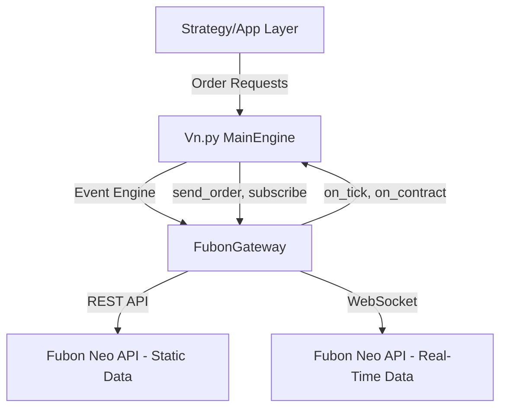

# Developer Guide for Fubon Gateway in vn.py

This document provides detailed information for developers working on the Fubon Gateway integration with vn.py. It covers the architecture, constant mappings, configuration, API usage, and troubleshooting steps to ensure smooth development and maintenance.

## Table of Contents
- [Architecture Overview](#architecture-overview)
- [Constant Mappings](#constant-mappings)
- [Configuration](#configuration)
- [API Usage](#api-usage)
- [Troubleshooting](#troubleshooting)
- [Testing](#testing)
- [CI/CD Pipeline](#cicd-pipeline)

## Architecture Overview

The Fubon Gateway is designed as a plugin for vn.py, adhering to the `BaseGateway` interface. It facilitates connectivity to the Fubon Neo API for trading and market data operations in Taiwan's financial markets.

### Key Components
- **FubonGateway Class**: Inherits from `BaseGateway`, handling connection, subscription, order management, and data queries.
- **WebSocket for Real-Time Data**: Utilizes Fubon Neo API's WebSocket for low-latency tick data subscription.
- **REST API for Static Data**: Uses HTTP endpoints for contract data, account, and position queries.
- **Event Engine Integration**: Leverages vn.py's event-driven architecture to push data updates via `on_tick`, `on_contract`, etc.

### Architecture Diagram


## Constant Mappings

Constant mappings ensure seamless translation between vn.py's enumerated types and Fubon Neo API's constants. These are defined in `src/enum_map.py`.

### Key Mappings
- **Direction**: Maps `Direction.LONG` to `BSAction.Buy` and `Direction.SHORT` to `BSAction.Sell`.
- **Order Types**: Maps `OrderType.LIMIT`, `MARKET`, `FAK`, `FOK` to combinations of Fubon's `PriceType` and `TimeInForce`.
- **Market Types**: Maps Fubon `MarketType` (e.g., `Common`, `TAIEX`, `AfterHour`) to vn.py `Exchange` (e.g., `TWSE`, `TOTC`) and `Product` (e.g., `EQUITY`, `INDEX`).
- **Futures/Options**: Specific mappings for futures and options market types to `Exchange.TAIFEX`.

### Mapping Table
| vn.py Constant          | Fubon Neo Constant                     | Notes                              |
|-------------------------|----------------------------------------|------------------------------------|
| `Direction.LONG`        | `BSAction.Buy`                        | Buy order direction               |
| `Direction.SHORT`       | `BSAction.Sell`                       | Sell order direction              |
| `OrderType.LIMIT`       | `(PriceType.Limit, TimeInForce.ROD)` | Limit order with rest of day      |
| `Exchange.TWSE`         | `MarketType.Common`, `MarketType.TAIEX` | Taiwan Stock Exchange mappings |
| `Product.EQUITY`        | `MarketType.Common`, `MarketType.Emerging` | Equity product type            |
| `Exchange.TAIFEX`       | `FutOptMarketType.Future`, `FutOptMarketType.Option` | Taiwan Futures Exchange |

**Note**: All mappings are bidirectional and tested for consistency in `tests/test_enum_map.py`.

## Configuration

Configuration for the Fubon Gateway is managed via a JSON file (`fubon_connect.json`) or through the vn.py UI settings.

### Configuration Parameters
- **UserID**: Your Fubon Neo API user ID.
- **Password**: Your Fubon Neo API password.
- **CA路徑**: Path to the certificate file (.pfx) for authentication.
- **CA密碼**: Password for the certificate file.
- **simulation**: Boolean flag for simulation mode (default: False).
- **下載合約**: Boolean flag to force download of contract data (default: False).
- **重連次數**: Number of reconnection attempts (default: 3).
- **重連間隔(秒)**: Delay between reconnection attempts in seconds (default: 5).

### Example Configuration
```json
{
  "UserID": "your_user_id",
  "Password": "your_password",
  "CA路徑": "path/to/certificate.pfx",
  "CA密碼": "certificate_password",
  "simulation": false,
  "下載合約": false,
  "重連次數": 3,
  "重連間隔(秒)": 5
}
```

## API Usage

### Connecting to Fubon Neo API
The gateway handles connection and login to the Fubon Neo API, distinguishing between stock and futures/options accounts.

### Subscribing to Market Data
- Use `subscribe` method to request real-time tick data for a specific symbol.
- WebSocket connection is initialized in low-latency mode (`Speed`).
- Subscribes to both `trades` and `books` channels for comprehensive data (tick and depth).

### Querying Contracts
- The `query_contracts` method fetches contract data for stocks and futures/options using REST API with retry logic for reliability.
- Contracts are mapped to `ContractData` objects and pushed via `on_contract`.

### Sending Orders
- Placeholder for `send_order` and `cancel_order` methods to be implemented for trading functionality.

## Troubleshooting

### Common Issues
- **Connection Failure**: Ensure UserID, Password, and CA credentials are correct. Check network connectivity.
- **Subscription Errors**: Verify that the symbol is valid and exists in the `contracts` dictionary.
- **API Rate Limits**: Fubon Neo API may throttle requests; the gateway includes retry logic to handle temporary failures.
- **Data Parsing Errors**: Log messages will indicate JSON parsing issues; ensure Fubon API responses match expected formats.

### Logs
- Logs are written via `write_log` method, accessible through vn.py's logging system.
- Check logs for detailed error messages and stack traces.

## Testing

### Unit Tests
- Unit tests for constant mappings are in `tests/test_enum_map.py`, covering bidirectional mapping accuracy using `pytest.parametrize`.
- Additional edge case tests have been added to handle unmapped or invalid values for direction, price type, and status mappings, ensuring robustness.

### Integration Tests
- Future integration tests should mock Fubon Neo API responses to validate contract fetching and tick data processing.

### Running Tests
```bash
pytest -v --cov=src
```

## CI/CD Pipeline

A GitHub Actions workflow is set up for continuous integration and deployment.

### Workflow Details
- **Trigger**: On push or pull request to `main` branch.
- **Jobs**:
  - `build-and-test`: Tests across Python versions 3.7-3.12, lints with flake8, and uploads coverage reports with a minimum coverage threshold of 90% for the `src` directory.
  - `publish`: Deploys to PyPI on successful push to `main`.
- **Configuration**: Located in `.github/workflows/python-ci.yml`.

### Secrets
- Ensure `PYPI_API_TOKEN` is set in GitHub repository secrets for deployment.

---

This guide aims to provide all necessary information for developing and maintaining the Fubon Gateway in vn.py. For further assistance, refer to the official Fubon Neo API documentation and vn.py community resources.
